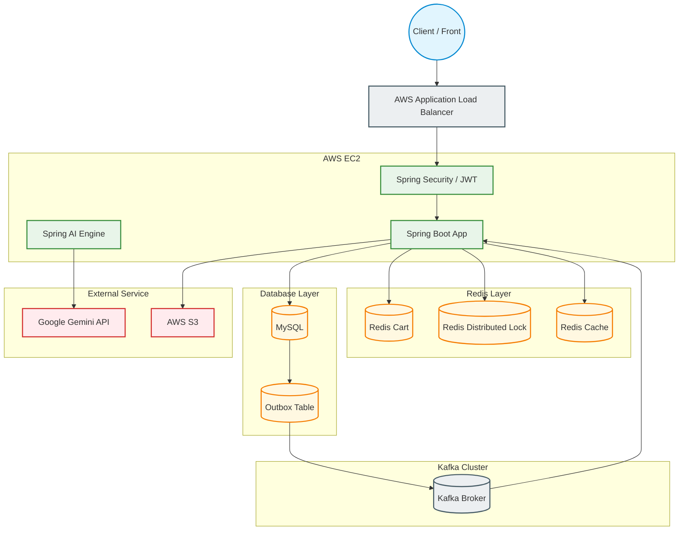

# OneStop - 하이브리드 고성능 커머스 플랫폼

> **"대용량 트래픽과 복잡한 비즈니스 정합성을 해결하는 고성능 커머스 아키텍처"**
>
> **OneStop**은 단일 쇼핑몰(쿠팡형)과 오픈 마켓플레이스(C2C/B2C)가 결합된 하이브리드 커머스 플랫폼입니다.
> 동시성 제어, 분산 트랜잭션 보장, AI 기반 편의 기능, 서버리스 인프라 환경을 구축하여 실제 운영 가능한 수준의 백엔드 시스템을 지향합니다.

---

# 📅 1. 프로젝트 개요 & 개발 일정

## 1.1 프로젝트 개요

* **플랫폼 핵심 가치**

  * 대규모 주문 처리 상황에서 데이터 일관성 보장
  * 사용자 맞춤형 AI 쇼핑 경험 제공

* **아키텍처 지향점**

  * 도메인 간 결합도를 낮춘 모듈러 구조 설계
  * 향후 MSA(Microservices Architecture)로 유연하게 확장 가능한 구조 지향

* **주요 타겟 지표**

  * 재고 / 포인트 / 쿠폰 영역의 동시성 병목 개선
  * 대용량 트래픽 상황에서의 고가용성 확보

---

## 1.2 개발 일정 (6주)

* **전체 기간**

  * 2026.05.11 ~ 2026.06.24

```text
[Phase 1] 요구사항 정의 및 ERD/API 설계 (05.11 ~ 05.17)
 ├── 유즈케이스 정의 및 도메인 바운더리 설정
 └── API 명세서 초안 작성 및 DB 모델링 확정

[Phase 2] 핵심 도메인 비즈니스 로직 개발 (05.18 ~ 06.02)
 ├── 회원, 상품, 주문, 결제, 배송 MVP 구현
 └── Spring Security + JWT 인증/인가 구조 세팅

[Phase 3] 동시성 제어 기술 도입 및 고도화 (06.03 ~ 06.12)
 ├── 비관적 락 / 낙관적 락 / Redis 분산락 적용
 └── Kafka 비동기 이벤트 및 Transactional Outbox 구축

[Phase 4] AI 기능 연동 및 장애 격리 설계 (06.13 ~ 06.18)
 ├── Spring AI + Tool Calling 적용
 └── Resilience4j Circuit Breaker 기반 장애 격리

[Phase 5] 부하 테스트 및 모니터링 최적화 (06.19 ~ 06.24)
 └── K6 부하 테스트 및 캐싱/인덱싱 성능 튜닝
```

---

# 👥 2. 프로젝트 및 팀원 소개

## 🏗️ 팀명: OneStop

> "단 한 번의 중단도 허용하지 않는 최고의 커머스 플랫폼"

| 이름  | 역할                       | 담당 도메인 및 핵심 기술                                            |
| --- | ------------------------ | --------------------------------------------------------- |
| 정은지 | 팀장 / Infra / AI          | 관리자 기능, CI/CD, 모니터링, Spring AI Tool Calling   |
| 임호진 | Auth / Seller / Member   | JWT 인증/인가, 회원/판매자 라이프사이클, Kafka Outbox                    |
| 정지훈 | Order / Pay / Coupon     | 장바구니, 주문, 결제, 쿠폰/포인트, 동시성 제어, Kafka Outbox, Redis Hash + ZSet, SSE + Redis PubSub|
| 이중현 | Product / Search         | 상품 카테고리, QueryDSL 검색 최적화, Redis 캐싱                        |
| 김예은 | Delivery / Review / Subs | 배송 상태 머신, 리뷰 정합성, 정기결제 자동화                                |

---

# 🛠️ 3. 기술 스택 (Tech Stack)

## Backend

* Java 17
* Spring Boot 3
* Spring Security
* Spring Data JPA
* QueryDSL
* Spring AI (Google Gemini OpenAI 호환)
* Spring Batch
* Spring Retry
* Redisson (Redis 분산락)
* Caffeine (로컬 캐시)
* OAuth2 Client (Kakao 소셜 로그인)
* Swagger / SpringDoc

## Database & Messaging

* MySQL
* Redis
* Apache Kafka

## Infrastructure

* AWS EC2
* AWS S3
* AWS ALB
* Docker
* GitHub Actions

## Monitoring & Testing

* K6
* Prometheus
* Grafana

## External API

* Google Gemini (OpenAI 호환 엔드포인트)

---

# 🏗️ 4. 시스템 아키텍처



---

# 🗄️ 5. ERD

```text
┌─ 회원 / 판매자 ─────────────────────────────────────────────┐
│ USER 1:1 SELLER                                           │
│ USER 1:1 CART                                             │
│ USER 1:1 POINT                                            │
│ USER 1:N ORDER                                            │
│ USER 1:N USER_COUPON                                      │
│ USER 1:N SUBSCRIPTION                                     │
│ USER 1:N REVIEW                                           │
│ USER 1:N NOTIFICATION  (user_id 컬럼, JPA FK 없음)        │
└────────────────────────────────────────────────────────────┘

┌─ 상품 ──────────────────────────────────────────────────────┐
│ SELLER 1:N PRODUCT                                        │
│ PRODUCT N:M CATEGORY  (via PRODUCT_CATEGORY_MAPPING)      │
│ PRODUCT 1:N PRODUCT_ITEM                                  │
│ PRODUCT 1:N PRODUCT_IMAGE                                 │
└────────────────────────────────────────────────────────────┘

┌─ 장바구니 (회원) ────────────────────────────────────────────┐
│ CART 1:N CART_ITEM                                        │
│ CART_ITEM N:1 PRODUCT_ITEM                                │
└────────────────────────────────────────────────────────────┘

┌─ 주문 / 결제 ───────────────────────────────────────────────┐
│ ORDER 1:N ORDER_ITEM                                      │
│ ORDER 1:1 PAYMENT                                         │
│ ORDER N:1 USER_COUPON  (선택)                              │
│ ORDER N:1 SUBSCRIPTION (구독 주문 시)                       │
│                                                           │
│ ORDER_ITEM N:1 SELLER                                     │
│ ORDER_ITEM N:1 PRODUCT_ITEM                               │
│ ORDER_ITEM 1:1 DELIVERY                                   │
│ ORDER_ITEM 1:1 REVIEW                                     │
└────────────────────────────────────────────────────────────┘

┌─ 쿠폰 / 포인트 ─────────────────────────────────────────────┐
│ COUPON 1:N USER_COUPON                                    │
│ USER_COUPON 0..1:1 ORDER  (used_order_id, 사용된 주문)     │
│                                                           │
│ POINT 1:N POINT_HISTORY                                   │
│ POINT_HISTORY N:1 ORDER   (선택)                          │
└────────────────────────────────────────────────────────────┘

┌─ 배송 / 리뷰 ───────────────────────────────────────────────┐
│ DELIVERY 1:N DELIVERY_HISTORY                             │
│ REVIEW 1:N REVIEW_IMAGE                                   │
└────────────────────────────────────────────────────────────┘
```

---

# 📝 6. 도메인별 주요 기능 및 비즈니스 정책

---

## 6.1 회원 / 인증 / 판매자 도메인

### 🔐 JWT 기반 무상태 인증 구조

* Access Token: 15분
* Refresh Token: 14일 (운영 기준)
* Redis 기반 RT 저장 및 블랙리스트 관리
* 강제 로그아웃 지원

### 👥 권한 정책

* ROLE_BUYER
* ROLE_SELLER
* ROLE_ADMIN
* ROLE_SUPER_ADMIN

### 🏪 판매자 상태 머신

```text
PENDING -> APPROVED -> SUSPENDED
```

* 승인된 판매자만 상품 등록 가능
* 판매자 정지 시 연관 상품 자동 비활성화

### 📦 Transactional Outbox

* 판매자 승인 이벤트를 Outbox Table에 저장
* 스케줄러가 Kafka 토픽으로 비동기 발행
* 이벤트 유실 방지 및 원자성 보장

---

## 6.2 상품 / 검색 도메인

### 📦 SKU(ProductItem) 표준화

* 무옵션 상품도 내부적으로 기본 SKU 생성
* 모든 재고 및 가격 처리를 SKU 단위로 통일

### 🔍 실시간 인기 검색어

* Redis ZSET + ZINCRBY 사용
* 시간 가중치 기반 랭킹 관리

### ⚡ QueryDSL 성능 최적화

복합 인덱스:

```sql
(category_id, status, created_at)
```

적용으로 검색 성능 개선

---

## 6.3 주문 / 결제 / 쿠폰 / 포인트

### 🛒 하이브리드 장바구니

* **비회원**: Redis Hash + ZSet 기반, TTL 7일
  * Hash: `itemId → quantity` (수량 저장)
  * ZSet: `itemId → 최초 담기 timestamp` (담기 순서 유지, 재담기 시 score 불변)
* **회원**: DB(MySQL) 기반 CartItem 엔티티로 영속 관리
* 로그인 시 `CartMergeExecutor`가 Redis 비회원 장바구니 → DB 회원 장바구니로 즉시 병합

### 💳 Mock 결제 처리

* 실제 PG 연동 없이 내부 Mock 결제 승인 처리
* 보상 트랜잭션 설계 적용 (포인트·쿠폰 선차감 후 결제 실패 시 롤백)
* PESSIMISTIC_WRITE 락으로 중복 결제 승인 방지

### 🎟️ 선착순 쿠폰 동시성 제어

전략 패턴으로 3가지 구현체를 제공하며 `coupon.issue.strategy` 설정으로 선택한다 (기본값: `decr`).

| 전략 | 방식 |
|---|---|
| `decr` (기본) | Redis DECR 원자 차감 + SISMEMBER 중복 발급 방어, Lua Script로 stock key 안전성 보장 |
| `lua` | 단일 Lua Script로 중복 체크·재고 차감을 하나의 원자 연산으로 처리 |
| `lock` | Redisson tryLock 기반 분산락으로 DB 직접 차감 |

---

### 🔔 실시간 알림 (SSE + Redis PubSub)

* Kafka Consumer(`PaymentApprovedConsumer`)가 결제 완료 이벤트를 수신 → Redis PubSub으로 발행
* `NotificationRedisSubscriber`가 메시지를 수신 → `SseConnectionManager`로 해당 유저에게 SSE 전송
* 멀티 인스턴스 환경에서도 Redis PubSub이 SSE 연결이 있는 서버로 이벤트를 브로드캐스트
* Notification 엔티티에 이벤트 이력 영속 저장 (중복 발송 방지를 위한 UK: `event_id`)

---

## 6.4 배송 / 리뷰 / 구독

### 🚚 배송 상태 머신

```text
ACCEPT
 -> INSTRUCT
 -> DEPARTURE
 -> DELIVERING
 -> FINAL_DELIVERY
```

* 역방향 상태 전이 차단

### ✍️ 리뷰 정합성

* 1주문 1리뷰 보장
* FINAL_DELIVERY 상태에서만 작성 가능

### 🔁 정기 구독 결제

* Spring Scheduler 기반 자동 결제

---

## 6.5 AI 및 장애 격리

### 🤖 Spring AI Tool Calling (Google Gemini)

* 자연어 기반 상품 검색
* 재고 조회 API 자동 호출
* Structured JSON Output 적용

### 🛡️ Resilience4j

* Circuit Breaker
* Fallback 전략
* 외부 장애 격리

---

# 📊 7. 기술적 선택 및 트레이드오프

| 적용 대상  | 선택 기술         | 선정 이유                 |
| ------ | ------------- | --------------------- |
| 상품 재고  | 비관적 락         | 높은 충돌 상황에서 강력한 정합성 보장 |
| 포인트    | 낙관적 락 + Retry | 충돌 가능성이 낮아 처리량 우선     |
| 선착순 쿠폰 | Redis 분산락     | DB 커넥션 보호 및 초고속 처리    |

---

# 🔐 8. 인증/인가 아키텍처

## JWT + Redis 기반 인증 구조

### Access Token

* Stateless 인증
* JWT Payload 최소화
* userId + role + JTI만 포함

### Refresh Token

* Redis 저장
* Device 기반 멀티 로그인 지원
* RTR(Rotate Refresh Token) 적용

### RTR 동시성 제어

Redis Lua Script 기반 CAS 처리:

```lua
if redis.call('GET', KEYS[1]) == ARGV[1] then
   redis.call('SET', KEYS[1], ARGV[2], 'EX', ARGV[3])
   return 1
else
   return 0
end
```

### 로그아웃 처리

* Access Token → Redis Blacklist 등록
* Refresh Token → Redis 삭제
* HttpOnly Cookie 만료 처리

---

# 📂 9. 프로젝트 구조

```text
com.sparta.one_stop/
├── domain/
│   ├── auth/
│   ├── user/
│   ├── seller/
│   ├── admin/
│   ├── product/
│   ├── cart/
│   ├── order/
│   ├── payment/
│   ├── coupon/
│   ├── point/
│   ├── delivery/
│   ├── review/
│   ├── subscription/
│   ├── notification/
│   └── ai/
│
├── global/
│   ├── config/
│   ├── security/
│   ├── oauth2/
│   ├── outbox/
│   ├── sse/
│   ├── ratelimit/
│   ├── alert/
│   ├── exception/
│   ├── response/
│   └── enums/
│
├── infra/
│   ├── scheduler/
│   └── monitoring/
│
└── OneStopApplication.java
```

---

# 📈 10. 성능 및 안정성 목표

* K6 기반 대량 트래픽 부하 테스트
* Redis 캐싱 및 인덱싱 기반 병목 제거
* Kafka 비동기 이벤트 기반 장애 전파 차단
* Circuit Breaker 기반 외부 장애 격리
* JWT Stateless 인증 구조로 세션 병목 제거

---

# 🚀 11. 향후 고도화 계획

* MSA 전환
* CQRS + Event Sourcing
* Elasticsearch 검색 고도화
* Kubernetes 기반 오토스케일링
* 실시간 추천 시스템
* AI 기반 상품 요약 및 리뷰 분석 고도화

---

# 📎 12. 외부 문서 링크

```text
[Wiki]
OneStop 상세 비즈니스 정책 문서

[Postman]
OneStop REST API 명세서

[Performance]
K6 부하 테스트 및 인덱스 분석 보고서
```

---

# 🧠 핵심 기술 키워드

`Spring Boot`
`Spring Security`
`JWT`
`Redis`
`Kafka`
`QueryDSL`
`Transactional Outbox`
`Distributed Lock`
`Resilience4j`
`Spring AI`
`AWS EC2`
`Google Gemini`
`K6`
`DDD`
`Modular Monolith`

